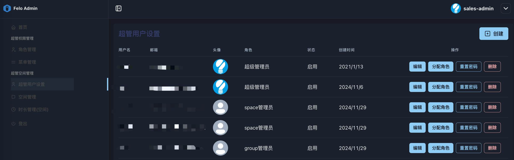
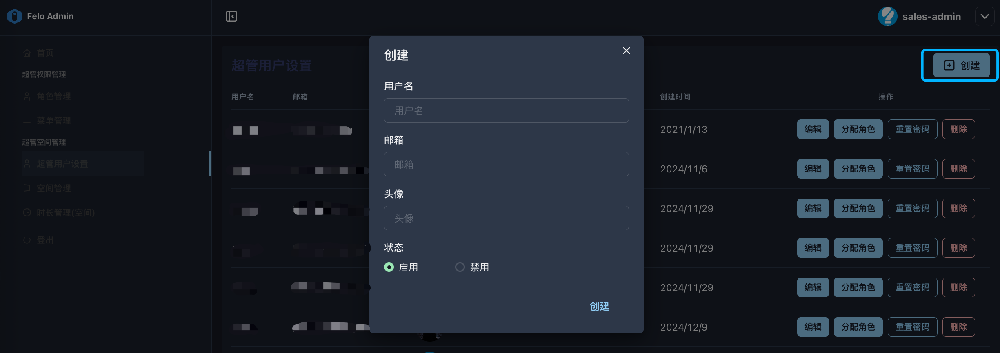

# 3.1 超管用户设置

<figure><figcaption></figcaption></figure>

**◼︎功能说明：**

此界面是系统的 **“租户空间管理员的账户管理页面”**。超级管理员（如 sales-admin）在这里为即将或已经拥有“空间(Space)”的租户，创建和管理其对应的管理员账户。

超级管理员可以在此界面上对空间管理员的账号进行全生命周期管理，包括创建新账户、编辑现有信息、分配权限角色、重置密码以及停用或删除账户。

**◼︎︎︎核心作用：**

此界面是**租户开户流程的第一站**，是连接“租户实体”与“系统服务”的关键桥梁。在为租户创建一个“空间”并分配“时长”之前，必须先在这里为租户的负责人**创建一个具体的、可登录的管理员账号**。因此，它确保了每个租户空间都有一个明确的、被授权的负责人。

**◼︎操作指南：**

超级管理员在此界面的主要工作流程如下：

1. **为新租户创建管理员账号：**

<mark style="color:red;">**注意：创建的新账号的密码统一为默认密码：888888**</mark>

<figure><figcaption></figcaption></figure>

2. **为创建的账号分配角色（设置权限）：**

<figure><figcaption></figcaption></figure>

<mark style="color:red;">注意：账号的角色</mark><mark style="color:red;">**直接决定了该账号是否有资格成为租户空间的管理员。**</mark>

* **超级管理员**：系统的最高权限。拥有此角色的用户不仅可以管理所有空间，还能管理整个系统的用户、角色和设置。
* **space管理员**：**空间管理员的标准角色**。拥有此角色的用户，在被授权后可以作为某个租户空间的管理员，管理该空间内的所有事务。（具体参照[3.2 空间管理](3.2-kong-jian-guan-li.md)的创建空间部分）
* **group管理员 / spaceManager**：较低级别的管理角色。这两种角色**无法**被指定为租户空间的管理员。

因此，如果想要将新建的账号设置为某个租户空间的管理员：请务必勾选 **space管理员**。

3. **密码重置**：当客户管理员忘记密码时，由超管在此为其重置。<mark style="color:red;">**重置后的密码为：888888**</mark>

<figure><figcaption></figcaption></figure>

3. **信息更新 (编辑) 或 账户停用 (删除)**：更新账号信息或者删除账户。

<figure><figcaption></figcaption></figure>

