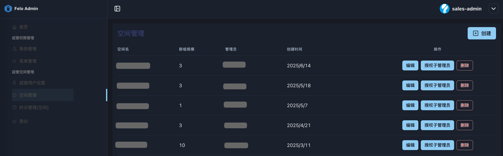
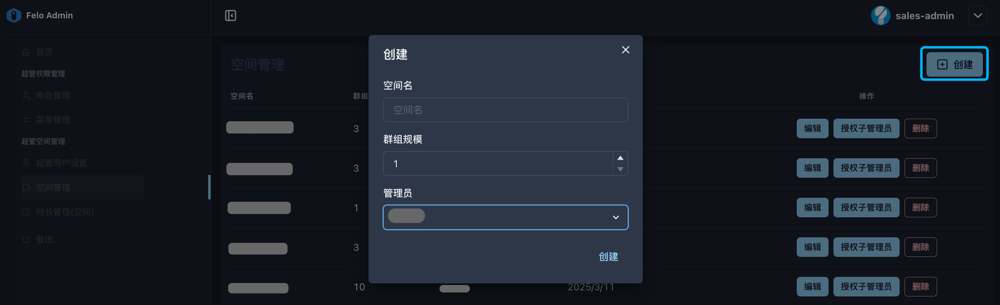
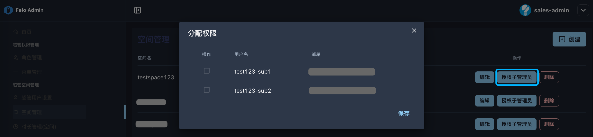

# 3.2 空间管理

<figure><figcaption></figcaption></figure>

**◼︎功能说明：**

“空间管理”界面是超级管理员**创建和配置租户空间**的核心平台。一个“租户空间”可以理解为提供给单个客户或团队的、一个完全隔离的专属服务环境。在此界面中，超级管理员可以创建新的租户空间，编辑或删除已有的租户空间，以及为租户空间授权子管理员。

**◼︎核心作用：**

此界面是**租户开户流程的第二站。**&#x5728;“[3.1 超管用户设置](3.1-chao-guan-yong-hu-she-zhi.md)”中为租户的管理员创建好账号后，下一步就是在这里为租户创建一个专属空间。它的核心作用有两点：

1. **实例化服务：** 将抽象的服务合同转化为一个具体、可操作的数字环境（空间）。
2. **委派管理权：** 通过在创建空间是授权管理员，将这个新建空间的日常管理权限，正式移交给客户方的管理员。这是从系统管理员到客户管理员的**权力交接点**。

**◼︎操作指南：**

超级管理员在此界面可以执行以下关键操作：

1. **创建空间，指定空间管理员：**

<figure><figcaption></figcaption></figure>

“创建”按钮将**创建空间**和**指派管理员**这两个核心步骤合并在了一起。

超级管理员需要在此填写新空间的全部基础信息，包括：

* **空间名**：客户或团队的专属名称。
* **群组规模**：该空间可容纳的成员上限。
* **管理员**：从下拉列表中选择该空间的**主管理员**。

2. **编辑空间信息 / 删除空间：**

<figure><figcaption></figcaption></figure>

3. **授权子管理员：**

<figure><figcaption></figcaption></figure>

* “授权子管理员”功能并非用于空间的初始管理员指派，而是一种**受控的权限提升与委托机制**。它允许超级管理员（Felo服务提供方）应空间管理员（如渠道商）的请求，将其管辖下的特定群组管理员提升为拥有更高管理权限的“子管理员”，以辅助主管理员进行更广泛的空间级管理。
* **典型应用场景**
  * **大型渠道商的内部协作：**\
    渠道商（空间管理员）可以将自己公司的运营助理或技术支持人员先设置为某个测试客户（群组）的管理员，然后请求Felo服务提供方（超级管理员）将其提升为子管理员，以便该助理能帮助管理所有客户的日常事务。
  * **重点客户的特殊授权：**\
    如果渠道商的某个终端客户（群组）是其非常重要的战略伙伴，渠道商可以请求总部将该客户的负责人提升为子管理员，给予他更大的管理自主权或数据可见性，作为一种增值服务。
