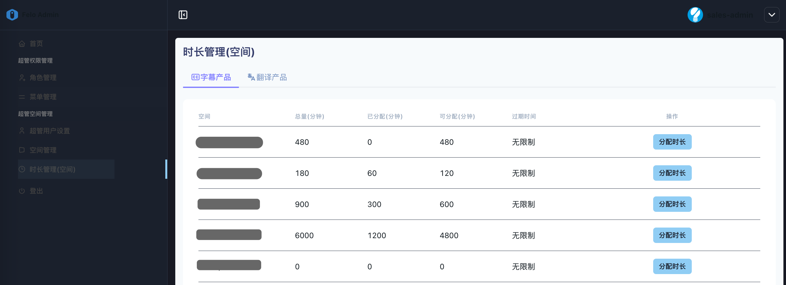
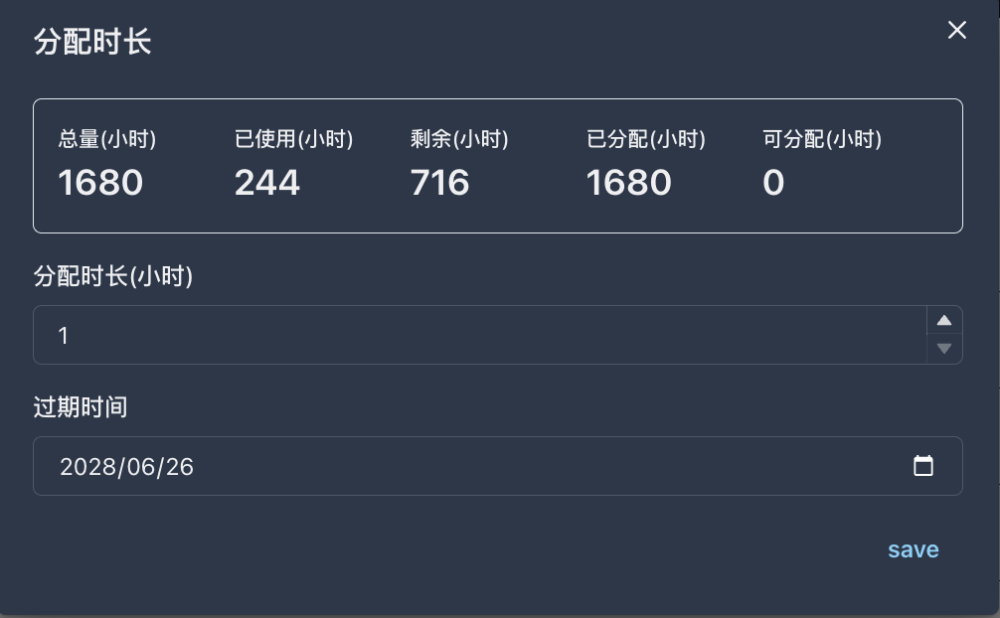

# 3.3 时长管理 (空间)

<figure><figcaption></figcaption></figure>

**◼︎功能说明：**

“时长管理(空间)”是超级管理员为租户（空间）进行**资源注入和调控**的中央平台。此界面清晰地展示了每个租户的“felo字幕”和“felo瞬译”产品的资源状态。列表中的每一行都对应一个租户，并详细列出了其名下特定产品的时长总量、已分配时长、以及当前可供分配的剩余时长。

**◼︎︎核心作用：**

此功能是整个SaaS服务**价值交付的核心环节**，是连接系统提供商与租户之间的**资源流转枢纽**。其核心作用在于：

1. **资源授权与注入:** 这是系统提供商向租户账户注入可使用资源（即“时长”）的官方入口。系统提供商在此处为其注入约定数量的服务时长。
2. **租户资源池监控:** 系统提供商可以实时监控每个租户的资源消耗速率（体现为“已分配”）和资源池余量（“可分配”），为续约管理、容量规划和商业分析提供精准的数据依据。
3. **多产品线计费支持:** 系统能够对“felo字幕”和“felo瞬译”等不同产品线进行独立的时长管理和计量，这为实现灵活、精细化的产品定价和组合销售策略提供了强大的后台支持。

**◼︎︎操作指南：**

超级管理员在此界面的标准操作流程如下：

* **1. 选择目标产品线：**
  * 在页面顶部的产品标签页（**felo字幕**、**felo瞬译**）中进行选择，以确保为正确的服务项目进行时长操作。各产品线的时长资源是相互独立的。
* **2. 定位目标租户：**
  * 在列表的“空间”（即“租户”）列中，找到需要进行资源操作的目标空间名（租户账户）。
* **3. 分配或调整时长：**
  * 点击“分配时长” 按钮，在弹出的对话框中为该租户设置时长总量
  * <mark style="color:red;">分配时长是以小时为单位</mark>
  * 过期时间必须设定

<figure><figcaption></figcaption></figure>

* **数据指标解读：**
  * 总量(小时): 系统提供商累计为该租户注入的资源总额。
  * 已使用(小时): 该租户已被使用的时长总和。
  * 剩余(小时): 总量(小时) - 已使用(小时)
  * 已分配(小时): 该租户当前资源池中，已分配的时长总额
  * 可分配(小时): 总量(小时) - 已分配(小时)
  * 过期时间: 标识该资源池的有效期。
