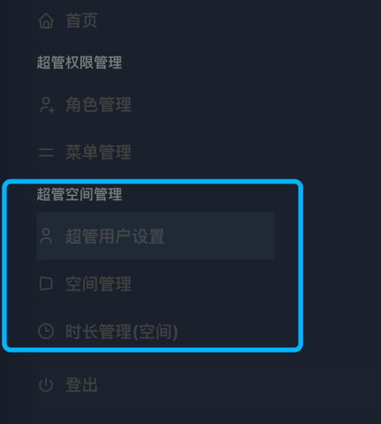

# 3. 超管空间管理

<figure><figcaption></figcaption></figure>

#### **超管空间管理**模块是系统的业务核心，它将“用户”、“空间”和“资源（时长）”这三个核心概念串联起来，完成从开通新租户到日常维护的完整闭环。

它由以下三个功能紧密相关的子模块组成：

[**3.1 超管用户设置**](3.1-chao-guan-yong-hu-she-zhi.md)

* **功能：创建和管理客户用户空间的管理员账户**
  * 在开通一个新空间（新客户）之前，**必须先为客户方的管理员创建一个用户账号**。
  * 在这里，超管可以创建新用户，并为他们分配角色（比如 space管理员）

[**3.2 空间管理**](3.2-kong-jian-guan-li.md)

* **功能：创建和管理客户的“工作区”**
  * 这是最核心的起点。在这里，超管可以为每一个新客户或团队创建一个独立的、隔离的**空间 (Space)**。
  * 主要操作包括：创建新空间、编辑空间信息（如名称、成员上限）、删除空间。
  * **关键操作：** 授权子管理员。创建空间后，超管需要在这里将一个已存在的用户指定为这个空间的管理员，把这个空间的日常管理权交出去。

[**3.3 时长管理 (空间)**](3.3-shi-chang-guan-li-kong-jian.md)

* **功能：分配和管理客户的核心资源**
  * 这个模块直接关系到业务的商业模式。超管在这里为每个“空间”分配其可用的**服务时长**。
  * 界面会清晰地显示每个空间的总时长、已用时长和剩余时长，方便进行资源监控和管理。
  * **关键操作：** 分配时长。根据客户购买的套餐或合同，为指定的空间设置总分钟数，或者在客户续费后增加时长。
