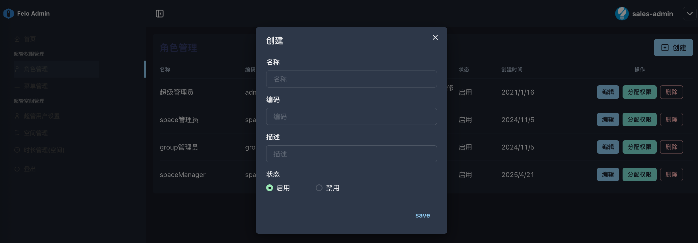
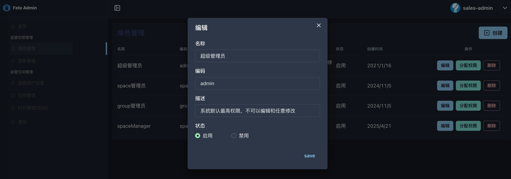

# 2.2 角色管理

* **功能说明**：该页面定义了不同的管理员角色，并为每个角色分配权限。
* **核心作用：**&#x8FD9;是连接**用户**和**权限**的桥梁。通过角色，管理员无需为每一个用户单独配置繁杂的权限。只需要给用户分配一个合适的角色，该用户就自动获得了这个角色所拥有的全部权限。这使得权限管理变得极为高效和规范。

*   **操作指南**：

    * **创建角色**：点击 创建，定义角色名称、编码和描述。
    * **分配权限**：创建角色后，最重要的一步是点击 分配权限。**系统会弹出“菜单管理”里定义的权限列表，勾选该角色应该拥有的操作权限。**
    * **注意**：<mark style="color:red;">“超级管理员”角色通常是系统内置的，拥有最高权限，不可编辑或删除。</mark>

* **系统已构建的四种角色：**

<table data-header-hidden><thead><tr><th width="149.35931396484375"></th><th width="182.34375"></th><th width="229.3228759765625"></th><th></th></tr></thead><tbody><tr><td>名称</td><td>编码</td><td>描述</td><td>状态</td></tr><tr><td>超级管理员</td><td>admin</td><td>
系统默认最高权限，

不可以编辑和任意修改
</td><td>启用</td></tr><tr><td>space管理员</td><td>space-admin</td><td>渠道商</td><td>启用</td></tr><tr><td>group管理员</td><td>group-admin</td><td>group管理人员</td><td>启用</td></tr><tr><td>spaceManager</td><td>space-manager</td><td>副管理员</td><td>启用</td></tr></tbody></table>

* **系统已设置的各角色的权限：**



**操作界面：**

* 创建角色：

<figure><figcaption></figcaption></figure>

* 编辑角色：

<figure><figcaption></figcaption></figure>

* 分配权限：

<figure><figcaption></figcaption></figure>

＊为角色勾选需要分配的权限。
