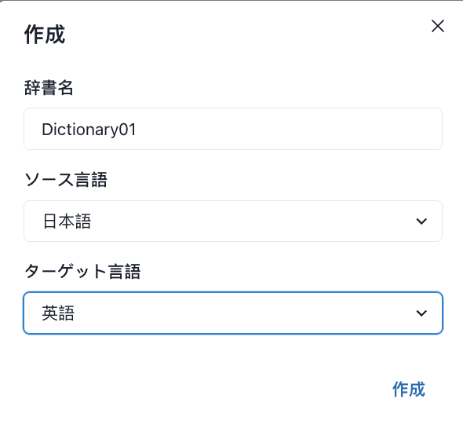

# 2.1 グループ管理者一覧

<figure><figcaption></figcaption></figure>

**◼︎機能説明：**\
この画面はテナント内部の管理者アカウントセンターであり、グループ管理者のアカウントを作成および管理するためのものです。これらのグループ管理者は、具体的なリソースグループを管理する責任者です。

◼︎**中核的な役割：**\
グループ管理者を作成することは、テナント内で権限を委任するための第一歩です。\
新しいリソースグループ（group）を作成する準備をする前に、space 管理者はここでリソースグループの管理アカウントを作成する必要があります。

**◼︎操作流れ：**

1. **グループ管理者の作成**：「作成」ボタンをクリックし、管理者のユーザー名、メールアドレスを設定して管理者アカウントを作成します。\
   デフォルトの初期パスワード：<mark style="color:red;">**888888**</mark>。\
   このアカウントの役割はデフォルトで「group 管理者」役割です。（参照 [2.2 ロール管理](../../spmanjgaido/2.-chao-guan-quan-xian-guan-li/2.2-jue-se-guan-li.md)）

<figure><figcaption></figcaption></figure>

2. 情報編集/アカウント削除： 対象の管理者に対応する「編集」ボタンをクリックすると、その基本情報を変更できます。「削除」ボタンをクリックすると、その管理者アカウントを削除できます。

<figure><figcaption></figcaption></figure>

3. パスワードのリセット：グループ管理者がパスワードを忘れた場合、「パスワードのリセット」ボタンを使用して再設定できます。リセット後のパスワード：888888

<figure><figcaption></figcaption></figure>

