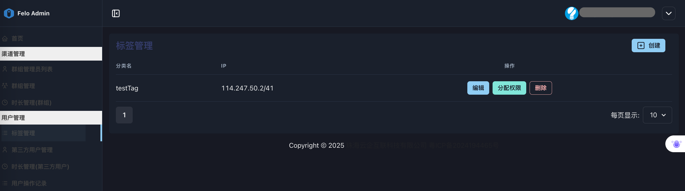
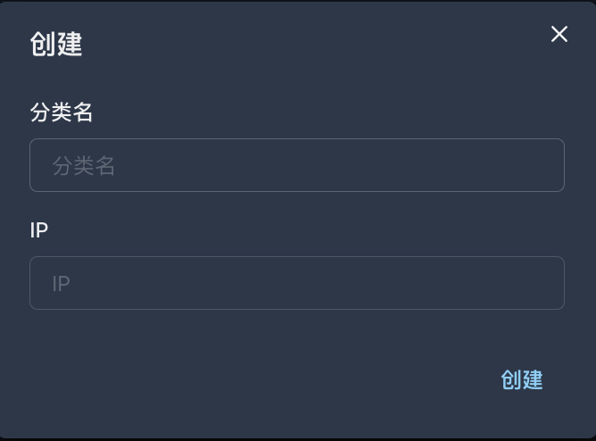
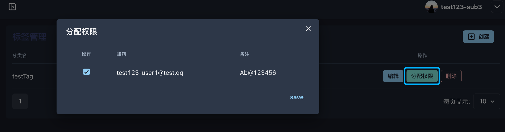

# 3.1 タグ管理

<figure><figcaption></figcaption></figure>

◼︎**機能説明**：\
「タグ管理」モジュールは、一連のポリシールールセット（Policy Rule Sets）を定義および管理するためのものです。各「タグ」は実質的に名前付きのポリシーであり、IPアドレス範囲をバインドすることで、詳細なアクセス制御とサービスルーティングルールを構築します。

**◼︎中核的な役割：**\
この機能は、テナント管理者に技術レベルでサービスを深くカスタマイズする能力を提供し、その核心的な役割は以下の通りです：

1. 安全なアクセス制御：IPホワイトリストを設定することで、特定の機能モジュールへのアクセス権限を信頼できるネットワーク環境に制限します。
2. 差別化サービス設定：異なるユーザーグループやアプリケーションシナリオに対して、異なるサービスを正確にマッチングさせ、機能、性能、またはコストの最適な組み合わせを実現します。
3. 戦略的管理：複雑な設定ルールを理解しやすく再利用可能な「タグ」として抽象化し、多数のエンドユーザーに統一された戦略を適用する際の複雑さを簡素化します。

**◼︎操作流れ：**

1. タグの作成：「作成」ボタンをクリックし、「分類名」（つまりタグ名）、「IP」（アクセスを許可するソースIPアドレスまたはCIDRアドレス範囲）を入力します。\
   注意：有効なIP 範囲（例：192.168.1.0/24）を入力する必要があります。

<figure><figcaption></figcaption></figure>

2. **分配权限：**&#x521B;建标签后，点击“分配权限”按钮，将该标签（策略）与具体的终端用户进行关联，从而使策略生效。具体的终端用户账号通过3.2 第三方用户管理进行创建。権限の割り当て：タグを作成した後、「権限の割り当て」ボタンをクリックして、そのタグ（ポリシー）を特定のエンドユーザーと関連付け、ポリシーを有効にします。具体的なエンドユーザーアカウントは[3.2 サードパーティユーザー管理](3.2-di-san-fang-yong-hu-guan-li.md)を通じて作成されます。

<figure><figcaption></figcaption></figure>

3. 編集と削除：既存のタグポリシーを修正または削除します。
