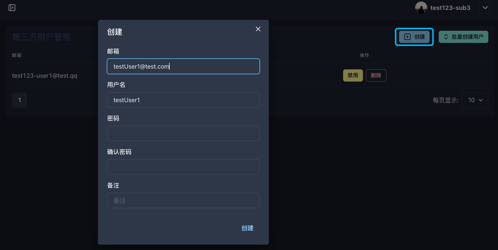
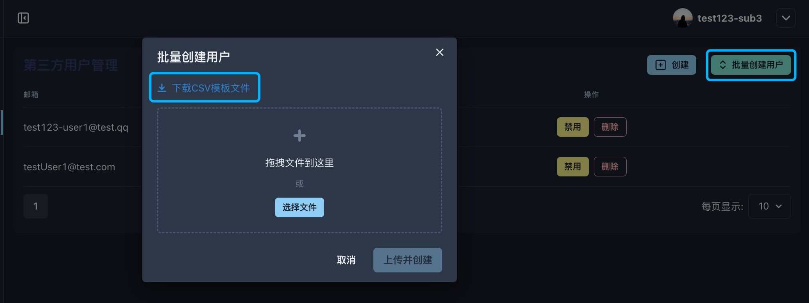
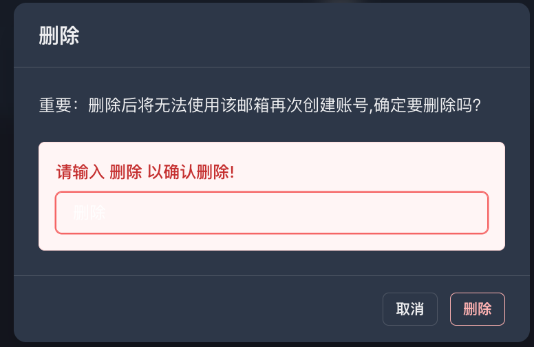

# 3.2 第三方用户管理

<figure><figcaption></figcaption></figure>

**◼︎功能说明：**\
此界面是当前群组环境内所有**终端用户 (End-Users)** 的集中管理中心。它以列表形式展示了所有最终使用产品服务的用户账户及其基本信息，如邮箱、备注和账户状态。

**◼︎核心作用：**\
作为**终端用户的信息管理**模块，该页面支持对终端用户进行创建、批量创建、禁用和删除等全生命周期操作。

**◼︎操作指南：**

1. **创建用户：** 点击“创建”按钮创建单个用户账户；\
   <mark style="color:red;">注意：密码必须至少包含8个字符、1个大写字母、1个数字和1个特殊字符</mark>

<figure><figcaption></figcaption></figure>

2. **批量创建用户：**&#x70B9;击“批量创建用户”可通过上传csv文件的方式导入多个用户。

<figure><figcaption>
批量创建用户
</figcaption></figure> <figure><figcaption>
csv文件模板
</figcaption></figure>

3. **管理用户状态：** 点击目标用户对应的“禁用”按钮可暂时中止其访问权限，再次点击可恢复。
4. **删除用户：** 点击“删除”按钮将永久移除该终端用户账户，且<mark style="color:red;">将无法使用该邮箱再次创建账号，因此请务必谨慎操作！</mark>

<figure><figcaption></figcaption></figure>

