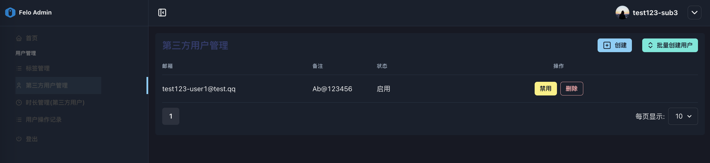

# 3.2 サードパーティユーザー管理

<figure><figcaption></figcaption></figure>

◼︎**機能説明**：\
このインターフェースは、現在のグループ環境内のすべてのエンドユーザーの集中管理センターです。リスト形式で、製品サービスを最終的に使用するすべてのユーザーアカウントとその基本情報（メールアドレス、備考、アカウントの状態など）を表示します。

**◼︎中核的な役割：**\
エンドユーザーの情報管理モジュールとして、このページはエンドユーザーの作成、一括作成、無効化、削除などのライフサイクル全体の操作をサポートします。

**◼︎操作流れ：**

1. ユーザーの作成： 「作成」ボタンをクリックして、単一のユーザーアカウントを作成します。\
   注意：<mark style="color:red;">パスワードは少なくとも8 文字、1つの大文字、1つの数字、1つの特殊文字を含める必要があります</mark>

<figure><figcaption></figcaption></figure>

2. 一括ユーザー作成：「一括ユーザー作成」をクリックすると、csvファイルをアップロードして複数のユーザーをインポートできます。

<figure><figcaption>
批量创建用户
</figcaption></figure> <figure><figcaption>
csv文件模板
</figcaption></figure>

3. ユーザーの状態を管理： 対象ユーザーの「禁用」ボタンをクリックすると、一時的にアクセス権を中止できます。再度クリックすると復元されます。
4. ユーザーを削除： 「削除」ボタンをクリックすると、**そのエンドユーザーアカウントが**<mark style="color:red;">**永久に**</mark>**削除され、そのメールアドレスで再度アカウントを作成することはできません。慎重に操作してください！**

<figure><figcaption></figcaption></figure>

