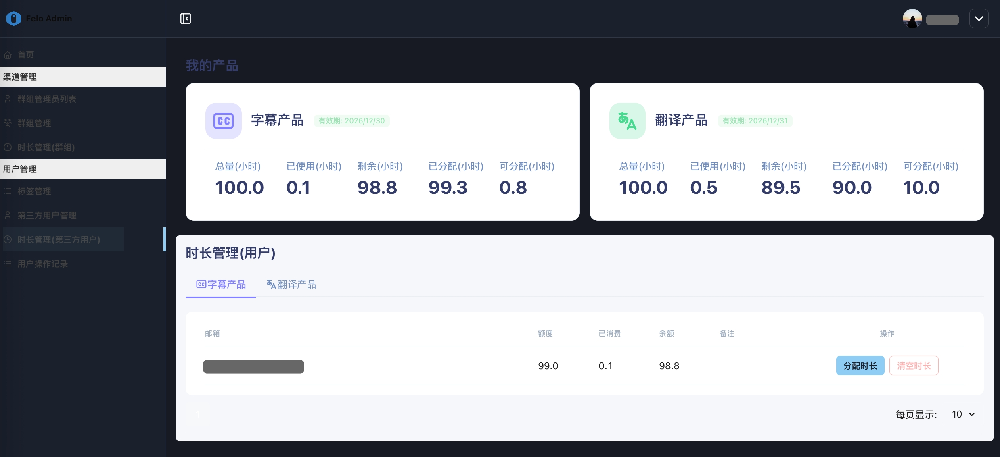
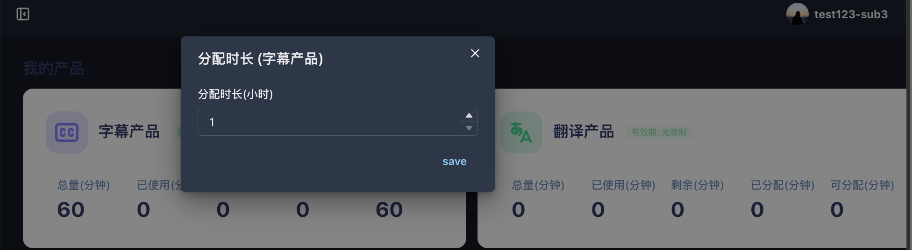

# 3.3 期間管理(サードパーティユーザー)

<figure><figcaption></figcaption></figure>

**◼︎機能説明**：\
このモジュールは、グループ管理者に対して、グループ内の個々のエンドユーザーの利用時間の配分を正確に設定、追加、またはリセットする機能を提供します。

**︎︎︎◼︎操作流れ：**

1. **リソースプールの監視**： ページ上部のカードには、現在のリソースグループにおけるfelo 字幕製品とfelo 翻訳製品の総利用時間情報が表示されます。
2. **分配時間**：felo 字幕製品またはfelo 翻訳製品のタブページをクリックし、ユーザーリストから対象ユーザーを見つけて「分配時間」をクリックします。ポップアップウィンドウで、そのユーザーに付与する具体的な時間数を入力します。この操作により、現在のグループの利用可能な時間総量から対応する額が差し引かれます。\
   分配する時間の製品名を確認してください。また、時間の分配は時間単位で行われます。

<figure><figcaption></figcaption></figure>

3. **時長をクリア**： 「清空时长」をクリックすると、そのユーザーの個人時長配分がゼロになります。\
   クリアされた時長はグループの「可分配（時間）」枠に回収されます。

<figure><figcaption></figcaption></figure>

