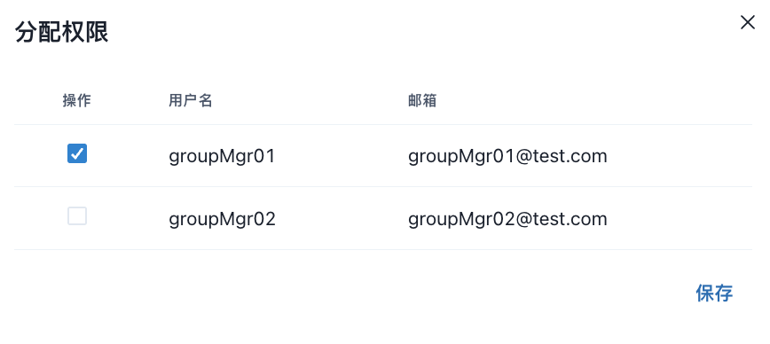

# 3.5 グループ辞書管理

<figure><figcaption></figcaption></figure>

**◼︎機能説明**：

「辞書管理」は、翻訳サービスの品質と一貫性を向上させるための専門機能です。この機能を利用することで、ユーザーは特定の専門用語、固有名詞、業界用語などを「カスタム辞書」として登録・管理することができます。

各用語集は、特定の言語ペア（例：元言語：日语 -> ターゲット言語：英语）に対応しており、登録された用語は、翻訳エンジンが処理を行う際に優先的に参照されます。これにより、一般的な翻訳結果を上書きし、指定された独自の訳語を適用させることが可能になります。

**◼︎中核的な役割：**

この機能の主な役割は、**翻訳の正確性と専門性のカスタマイズ**です。その中核的な目的は以下の通りです。

1. **用語の統一:**\
   企業内の製品名、ブランド名、特定の技術用語などの訳語を組織全体で統一し、ドキュメントやコミュニケーションにおける表記の揺れを防ぎます。
2. **翻訳精度の向上:**\
   AI翻訳が誤訳しやすい、または複数の訳語が存在する多義的な単語に対し、文脈に即した最適な訳語を強制的に指定することで、翻訳の品質を大幅に向上させます。
3. **ブランド保護 :**\
   自社のブランド名やスローガンが不適切に翻訳されることを防ぎ、ブランドイメージの一貫性を維持します。

**◼︎操作手順：**

1. **辞書の作成：**\
   画面右上の 「作成」ボタンをクリックして、表示されたフォームに、新しい辞書の情報を入力します。\
   最大５個の辞書を作成できます。

<figure><figcaption></figcaption></figure>

2. **用語の追加と管理 :**

* 作成した辞書の 「表示」ボタンをクリックして、用語リストを表示する。\
  登録済みの用語を「編集」と「削除」することは可能です。

<figure><figcaption></figcaption></figure>

* 「用語作成」ボタンをクリックして、個別の用語ペアを一つずつ追加します。

<figure><figcaption></figcaption></figure>

* &#x20;「一括インポート」で、用語集を一括インポートも可能です。

<figure><figcaption></figcaption></figure>

3. **辞書の有効化/無効化:**\
   辞書リスト内の「ステータス」を操作して、辞書の有効化/無効化を制御します。

* オンの場&#x5408;**:** この用語集は**有効**であり、翻訳処理時にこの中の用語が参照されます。
* オフの場&#x5408;**:** この用語集は**無効**であり、一時的に翻訳処理から除外されます。
