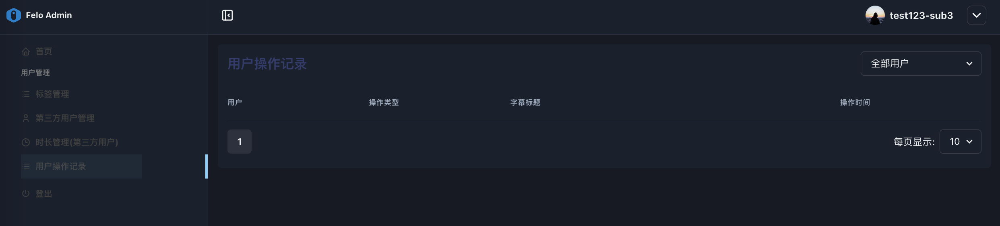

# 3.4 ユーザー操作記録

このインターフェースは、エンドユーザーによるFelo 字幕のダウンロードと削除の記録を記録しています。\
右上のドロップダウンメニューを使用して、「すべてのユーザー」または特定のユーザーを選択してログをフィルタリングできます。\
リストは、ユーザーの操作記録を時間の降順で表示し、操作ユーザー、操作タイプ、操作の詳細（Felo 字幕のタイトル）、および操作時間を含みます。

このログ記録機能の目的は次の通りです：

* 問題のトラブルシューティング： 使用上の異常が発生したり、ユーザーから問題が報告された場合、このログを通じて操作手順を追跡し、問題の根本原因を特定するのに役立ちます。
* 使用分析： ユーザー操作ログを分析することで、製品機能の使用頻度などのデータを取得し、ビジネスの最適化に役立つ情報を提供します。

<figure><figcaption></figcaption></figure>
