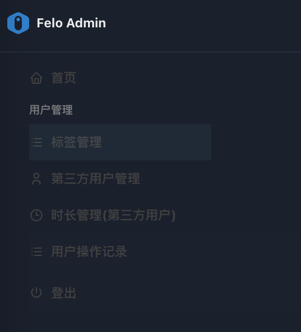

# 3. 用户管理

<figure><figcaption></figcaption></figure>

「ユーザー管理」モジュールは、グループ管理者（group 管理者またはspaceManager）がその管轄するグループ内のエンドユーザーに対して時間配分を行うためのコア機能集です。\
「パートナー管理」モジュールとは異なり、このモジュールは管轄するグループ内で最終的に製品サービスを使用するユーザーエンティティの詳細な管理に焦点を当てています。

このモジュールは主に以下の4つのメニューコンポーネントを含みます：

3.1 タグ管理: 高度なアクセス制御とサービスポリシーの定義と管理を担当します。\
注意：タグ管理機能は「group 管理者」ロールには表示されません。

3.2 サードパーティユーザー管理: エンドユーザーアカウントの集中作成と管理を担当します。

3.3 期間管理(サードパーティユーザー)：単一のエンドユーザーに対する時間リソースの配分を担当します。

3.4 ユーザー操作記録: グループ内のエンドユーザーの操作行動を記録します。

通过这些组件，群组管理员（group管理员或spaceManage&#x72;**）**&#x80FD;够实现对终端用户的资源分配的全方位管理，确保服务的安全、合规与高效运行。

これらのコンポーネントを通じて、グループ管理者（group 管理者またはspaceManager）は、エンドユーザーへのリソース配分を包括的に管理し、サービスの安全性、コンプライアンス、および効率的な運用を確保することができます。
