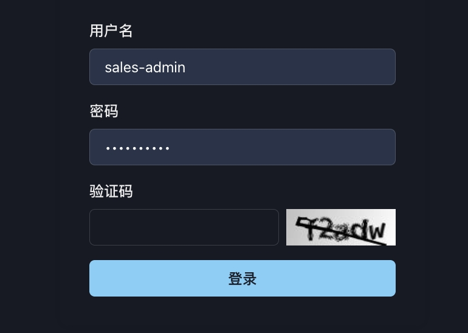
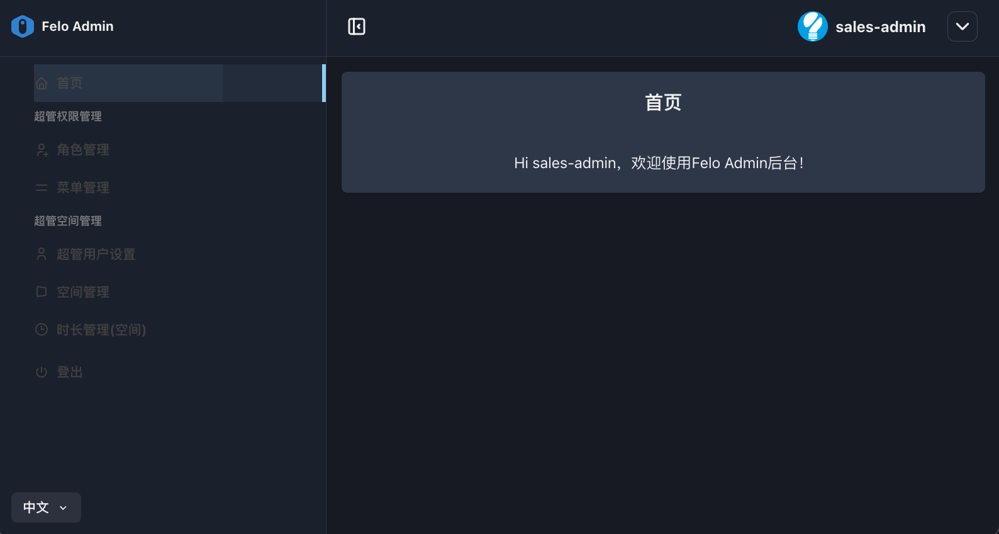
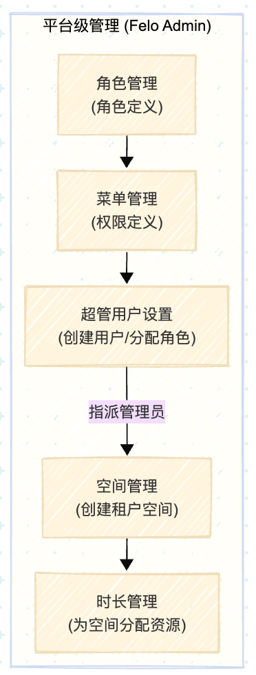
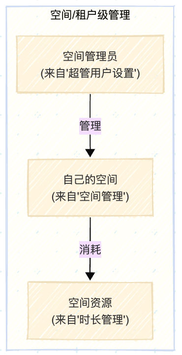

# 1. 开始使用

### 1.1. 系统登录：

访问以下URL，登录felo.cc Console后台系统：

[https://console.felo.cc/login](https://console.felo.me/login)

（登录用户名/密码请询问Sparticle系统管理员）

<figure><figcaption></figcaption></figure>

<figure><figcaption></figcaption></figure>

* **左侧导航栏**：系统的主要功能模块入口。包含<kbd>**超管权限管理**</kbd>和 **超管空间管理** 两部分功能
* **顶部信息栏**：显示当前登录的用户名（sales-admin），提供登出等操作。
* **主内容区**：显示欢迎信息或当前选定模块的具体内容。
*

### 1.2. **核心概念解析：**

* **角色**：权限的集合。定义了一个角色能看到哪些菜单、能执行哪些操作（例如：space管理员、group管理员）。
* **菜单**：即**权限 (Permission)，**&#x7CFB;统中最小的操作单元，例如“创建菜单”、“删除用户”等。权限被打包进“角色”中。
* **空间 (Space)**：可以理解为一个独立的租户。每个“空间”有自己的管理员、成员规模和最重要的——**使用时长**。这是系统管理的核心对象。
* **时长 (Duration)**：分配给每个“空间”的资源，单位为分钟。管理员可以为每个空间设置总时长，系统会跟踪已分配和可用的时长。
*

### **1.3. 管理操作流程图：**

<figure><figcaption></figcaption></figure> <figure><figcaption></figcaption></figure>

### **1.4. 租户模型理解：**

<table data-header-hidden><thead><tr><th width="238.6510009765625"></th><th width="179.9583740234375"></th><th></th></tr></thead><tbody><tr><td>名称</td><td>对应实体</td><td>描述说明</td></tr><tr><td>服务提供商</td><td>超级管理员</td><td>Felo Admin 平台的所有者和最高级别运营方，负责创建和管理租户账户。</td></tr><tr><td>租户 (Tenant)</td><td>空间 (Space)</td><td>系统中一个独立的、安全的、隔离的顶层账户。每个租户代表一个独立的客户实体。</td></tr><tr><td>租户管理员</td><td>空间管理员 (space管理员)</td><td>由系统提供商创建的、负责管理特定<strong>租户</strong>账户的主用户。</td></tr><tr><td>资源组 (Resource Group)</td><td>群组 (Group)</td><td>由租户管理员在其租户环境内创建的逻辑子单元，用于进一步组织用户和资源。</td></tr><tr><td>组管理员 (Group Admin)</td><td>群组管理员 (group管理员)</td><td>由租户管理员创建的、用于管理特定资源组的用户，其权限被限制在该组内。</td></tr></tbody></table>
