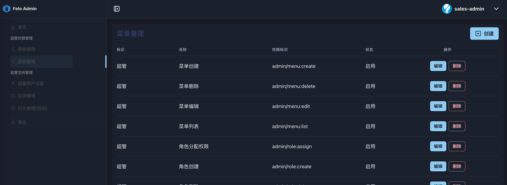
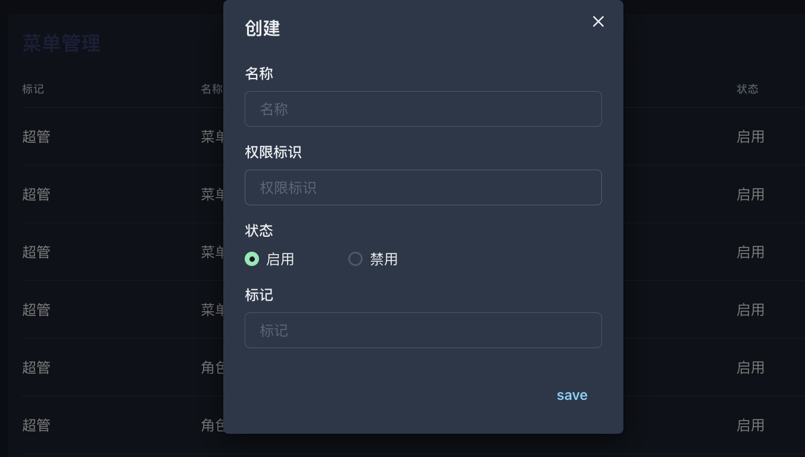
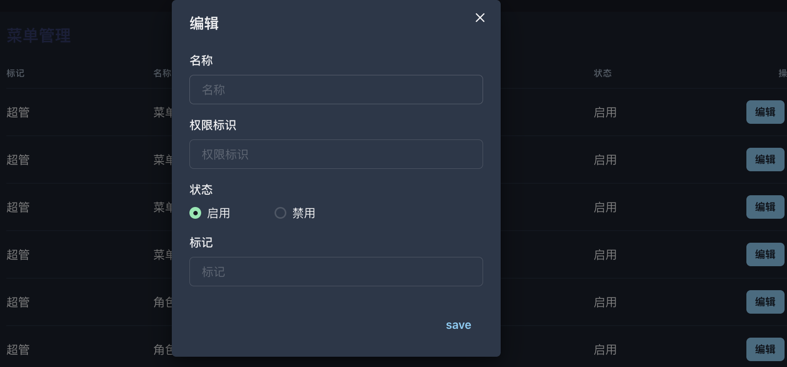

# 2.1 菜单管理

<figure><figcaption></figcaption></figure>

* **功能说明**：这里定义了系统中所有可以被赋予的“操作权限点”（权限标识，如 admin/menu:create）。每个菜单项或操作按钮都对应一个权限点。
* **核心作用：** 这是权限系统的**原子库**。所有权限的源头都在这里定义。如果未来系统增加了新功能（比如一个新的“数据导出”按钮），就需要先在“菜单管理”里为它创建一个新的权限，然后才能将这个权限分配出去。
* **操作指南**：<mark style="color:red;">此模块通常由开发人员或最高管理员维护，用于定义系统中有哪些权限可供分配</mark>。普通管理员主要是去“角色管理”中“使用”这些权限，而不是在这里创建。

**操作界面：**

* 创建菜单：

<figure><figcaption></figcaption></figure>

* 编辑菜单

<figure><figcaption></figcaption></figure>

**系统已设置的58种权限：**

<table><thead><tr><th width="48.5">No</th><th width="112.94268798828125">标记</th><th width="223.578125">名称</th><th width="269.53125">权限标识</th><th width="88.75">状态</th></tr></thead><tbody><tr><td>1</td><td>超管</td><td>菜单创建</td><td>admin/menu:create</td><td>启用</td></tr><tr><td>2</td><td>超管</td><td>菜单删除</td><td>admin/menu:delete</td><td>启用</td></tr><tr><td>3</td><td>超管</td><td>菜单编辑</td><td>admin/menu:edit</td><td>启用</td></tr><tr><td>4</td><td>超管</td><td>菜单列表</td><td>admin/menu:list</td><td>启用</td></tr><tr><td>5</td><td>超管</td><td>角色分配权限</td><td>admin/role:assign</td><td>启用</td></tr><tr><td>6</td><td>超管</td><td>角色创建</td><td>admin/role:create</td><td>启用</td></tr><tr><td>7</td><td>超管</td><td>角色删除</td><td>admin/role:delete</td><td>启用</td></tr><tr><td>8</td><td>超管</td><td>角色编辑</td><td>admin/role:edit</td><td>启用</td></tr><tr><td>9</td><td>超管</td><td>角色列表</td><td>admin/role:list</td><td>启用</td></tr><tr><td>10</td><td>空间管理</td><td>超管设置</td><td>admin/user</td><td>启用</td></tr><tr><td>11</td><td>空间管理</td><td>超管用户创建</td><td>admin/user:create</td><td>启用</td></tr><tr><td>12</td><td>空间管理</td><td>超管用户删除</td><td>admin/user:delete</td><td>启用</td></tr><tr><td>13</td><td>空间管理</td><td>超管用户编辑</td><td>admin/user:edit</td><td>启用</td></tr><tr><td>14</td><td>空间管理</td><td>超管用户列表</td><td>admin/user:list</td><td>启用</td></tr><tr><td>15</td><td>空间管理</td><td>超管用户重置密码</td><td>admin/user:repassword</td><td>启用</td></tr><tr><td>16</td><td>用户管理</td><td>标签创建</td><td>app/category:create</td><td>启用</td></tr><tr><td>17</td><td>用户管理</td><td>category管理</td><td>app/category:list</td><td>启用</td></tr><tr><td>18</td><td>群组管理</td><td>群组创建</td><td>app/group:create</td><td>启用</td></tr><tr><td>19</td><td>群组管理</td><td>群组删除</td><td>app/group:delete</td><td>启用</td></tr><tr><td>20</td><td>群组管理</td><td>群组编辑</td><td>app/group:edit</td><td>启用</td></tr><tr><td>21</td><td>群组管理</td><td>群组列表</td><td>app/group:list</td><td>启用</td></tr><tr><td>22</td><td>空间管理</td><td>空间创建</td><td>app/space:create</td><td>启用</td></tr><tr><td>23</td><td>空间管理</td><td>空间删除</td><td>app/space:delete</td><td>启用</td></tr><tr><td>24</td><td>空间管理</td><td>空间编辑</td><td>app/space:edit</td><td>启用</td></tr><tr><td>25</td><td>用户管理</td><td>空间列表</td><td>app/space:list</td><td>启用</td></tr><tr><td>26</td><td>用户管理</td><td>用户操作记录</td><td>app/thirdUser/action:list</td><td>启用</td></tr><tr><td>27</td><td>用户管理</td><td>日志行为查询</td><td>app/thirdUser:cation</td><td>启用</td></tr><tr><td>28</td><td>用户管理</td><td>第三方用户创建</td><td>app/thirdUser:create</td><td>启用</td></tr><tr><td>29</td><td>用户管理</td><td>第三方用户删除</td><td>app/thirdUser:delete</td><td>启用</td></tr><tr><td>30</td><td>用户管理</td><td>第三方用户列表</td><td>app/thirdUser:list</td><td>启用</td></tr><tr><td>31</td><td>群组管理</td><td>群组时长分配</td><td>duration/group:assign</td><td>启用</td></tr><tr><td>32</td><td>群组管理</td><td>群组时长详情</td><td>duration/group:detail</td><td>启用</td></tr><tr><td>33</td><td>群组管理</td><td>群组时长列表</td><td>duration/group:list</td><td>启用</td></tr><tr><td>34</td><td>群组管理</td><td>群组时长查询</td><td>duration/group:query</td><td>启用</td></tr><tr><td>35</td><td>群组管理</td><td>群组时长回收</td><td>duration/group:recycle</td><td>启用</td></tr><tr><td>36</td><td>空间管理</td><td>空间时长分配</td><td>duration/space:assign</td><td>启用</td></tr><tr><td>37</td><td>空间管理</td><td>空间时长详情</td><td>duration/space:detail</td><td>启用</td></tr><tr><td>38</td><td>空间管理</td><td>空间时长列表</td><td>duration/space:list</td><td>启用</td></tr><tr><td>39</td><td>空间管理</td><td>空间时长查询</td><td>duration/space:query</td><td>启用</td></tr><tr><td>40</td><td>用户管理</td><td>第三方用户时长分配</td><td>duration/thirdUser:assign</td><td>启用</td></tr><tr><td>41</td><td>用户管理</td><td>第三方用户时长列表</td><td>duration/thirdUser:list</td><td>启用</td></tr><tr><td>42</td><td>用户管理</td><td>用户时长回收</td><td>duration/thirdUser:recycle</td><td>启用</td></tr><tr><td>43</td><td>用户管理</td><td>用户所在群组查询</td><td>group/user:location</td><td>启用</td></tr><tr><td>44</td><td>群组管理</td><td>群组管理人员设置</td><td>group/user:perm</td><td>启用</td></tr><tr><td>45</td><td>群组管理</td><td>群组管理人员分配查询</td><td>group/user:query</td><td>启用</td></tr><tr><td>46</td><td>空间管理、群组管理</td><td>空间用户创建</td><td>space/user:create</td><td>启用</td></tr><tr><td>47</td><td>群组管理</td><td>空间用户删除</td><td>space/user:delete</td><td>启用</td></tr><tr><td>48</td><td>群组管理</td><td>空间用户编辑</td><td>space/user:edit</td><td>启用</td></tr><tr><td>49</td><td>空间管理、群组管理</td><td>空间用户列表</td><td>space/user:list</td><td>启用</td></tr><tr><td>50</td><td>空间管理</td><td>空间子管理员设置</td><td>space/user:perm</td><td>启用</td></tr><tr><td>51</td><td>空间管理</td><td>空间子管理员分配查询</td><td>space/user:query</td><td>启用</td></tr><tr><td>52</td><td>群组管理</td><td>空间用户重置密码</td><td>space/user:repassword</td><td>启用</td></tr><tr><td>53</td><td>超管</td><td>系统管理</td><td>sys:manage</td><td>启用</td></tr><tr><td>54</td><td>超管</td><td>系统工具</td><td>sys:tools</td><td><mark style="color:red;">禁用</mark></td></tr><tr><td>55</td><td>title标签</td><td>超级管理员标签</td><td>tag-admin-manage:tag</td><td>启用</td></tr><tr><td>56</td><td>title标签</td><td>合作伙伴标签</td><td>tag-partner-manage:tag</td><td>启用</td></tr><tr><td>57</td><td>空间管理</td><td>超管空间管理</td><td>tag-space-manage:tag</td><td>启用</td></tr><tr><td>58</td><td>title标签</td><td>用户标签</td><td>tag-user-manage:tag</td><td>启用</td></tr></tbody></table>
