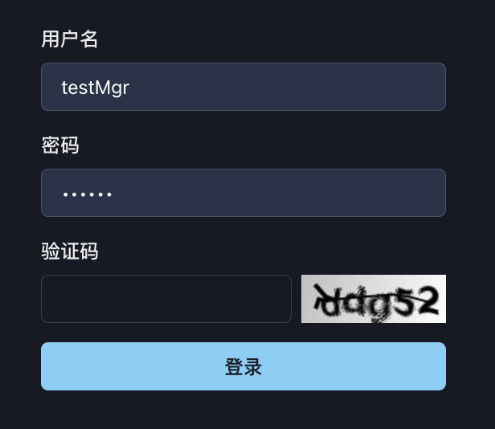
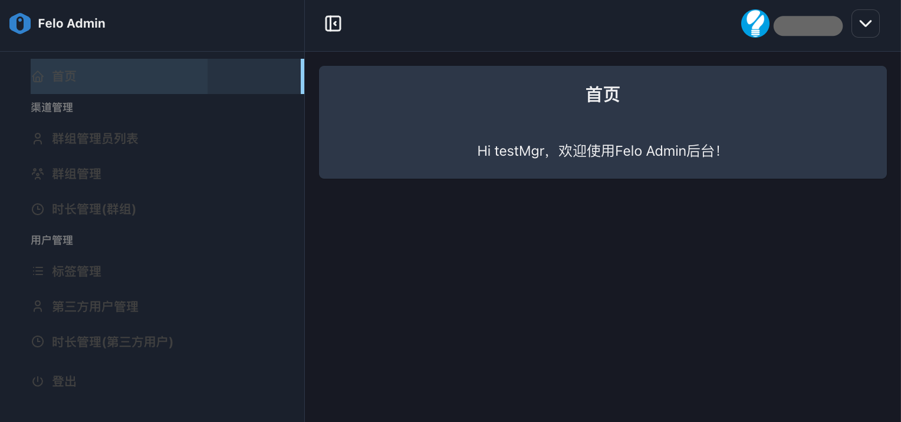
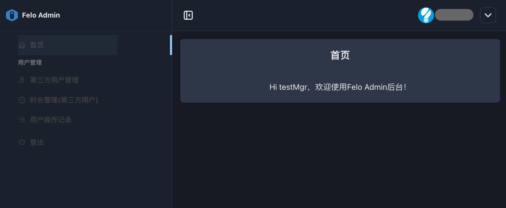
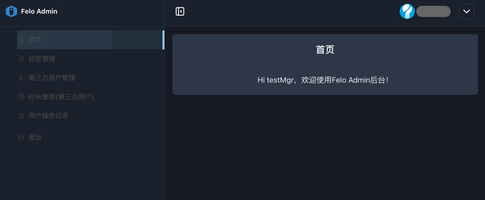

# 1. 开始使用

### 1.1. 系统登录：

访问以下URL，登录felo.cc Console后台系统：

[https://console.felo.cc/login](https://console.felo.me/login)

<figure><figcaption></figcaption></figure>

用户名/密码由系统超级管理员在[3.1 超管用户设置](../3.-chao-guan-kong-jian-guan-li/3.1-chao-guan-yong-hu-she-zhi.md)页面进行创建。具体请询问Sparticle系统管理员。

### 1.2. 不同角色的管理员的操作界面差异：

不同角色由3.1 超管用户设置页面进行角色分配（设置权限）。

* **space管理员:** 有权限操作“渠道管理”菜单和“用户管理”菜单。
* **spaceManager:** 只能够操作“用户管理”菜单，同时可以进行**标签管理。**
* **group管理员:** 只能够操作“用户管理”菜单，且无权进行**标签管理。**

<figure><figcaption>
space管理员登陆后界面
</figcaption></figure> <figure><figcaption>
Group管理员登陆后界面
</figcaption></figure> <figure><figcaption>
spaceManager管理员登陆后界面
</figcaption></figure>

###

### 1.3. 三种角色的定位与关系解析：

在租户的内部管理体系中，这三个角色构成了清晰的**管理层级**：

* **space管理员 (主管理员/Owner):**
  * **定位:** 租户空间的**最高管理者和所有者**。
  * **职责:** 对整个租户的业务和资源负总责。包括：创建和管理所有资源组、任命和管理下级的spaceManager和group管理员、从系统提供商处接收总时长并向下分配、对组内用户进行管理等。
* **spaceManager (子管理员/Manager):**
  * **定位:** 租户的**高级经理或副手**。
  * **职责:** 其权限由主管理员授予，协助主管理员对资源组内的用户进行管理。包括标签管理，时长分配等。但无具备如资源组创建、任命资源组管理员等高级权限。他们是主管理员的得力助手。
* **group管理员 (资源组管理员):**
  * **定位:** **租户内部各资源组的负责人**。
  * **职责:** 只对自己负责的特定资源组内的事务负责，包括管理该组的用户和时长分配等。和**spaceManager** 的权限差异主要体现在标签管理权限上。**group管理员不具备标签管理权限。**
