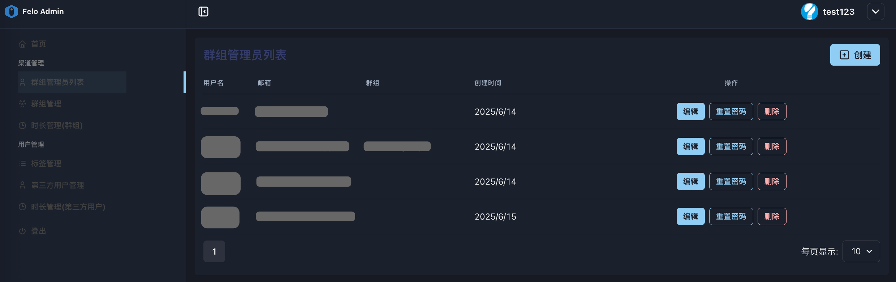

# 2.1 群组管理员列表

<figure><figcaption></figcaption></figure>

**◼︎功能说明：**\
此界面是租户内部的**管理员账户中心**，用于创建和管理**组管理员 (group管理员)** 的账号。这些组管理员是负责管理具体**资源组**的管理者。

**◼︎核心作用：**\
创建群组管理员是租户内部**进行权限委托的第一步**。\
在准备创建一个新的资源组（group）之前，space管理员需要先在这里为资源组创建一个管理账号。

**◼︎操作指南：**

1. **创建群组管理员：**&#x70B9;击“创建”按钮，设置管理员的用户名、邮箱，创建管理员账号。\
   <mark style="color:red;">默认初始密码：888888</mark>。\
   该账号的角色默认为“group管理员”角色。（参照[2.2 角色管理](../../xi-tong-chao-ji-guan-li-yuan-zhi-nan/2.-chao-guan-quan-xian-guan-li/2.2-jue-se-guan-li.md)）

<figure><figcaption></figcaption></figure>

2. **编辑信息 /删除账户：** 点击目标管理员对应的“编辑”按钮，可以修改其基本信息。点击“删除”按钮可移除该管理员账户。

<figure><figcaption></figcaption></figure>

3. **重置密码：** 当组管理员忘记密码时，您可以通过“重置密码”按钮为其重设。<mark style="color:red;">重置后密码：888888</mark>

<figure><figcaption></figcaption></figure>

