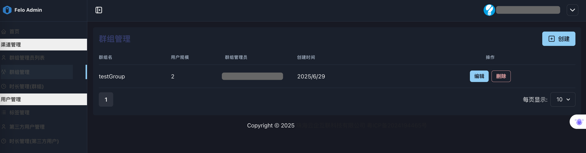
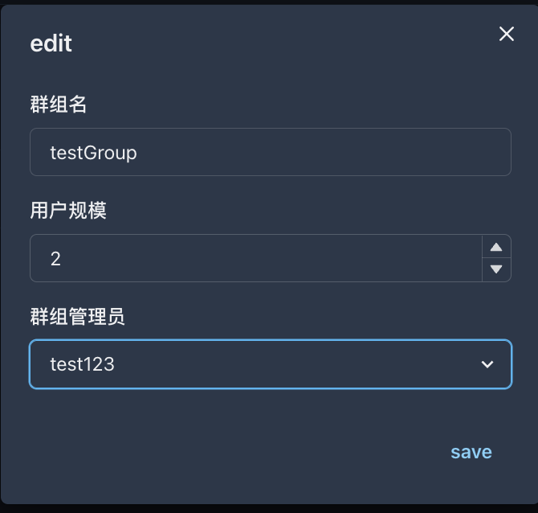

# 2.2 群组管理

<figure><figcaption></figcaption></figure>

**◼︎功能说明：**\
此界面用于创建和管理租户内部的**资源群组 (Groups)**。一个资源组可以灵活地代表内部的一个部门、一个项目团队，或者（如果是渠道商）一个独立的终端客户。列表中展示了每个资源组的名称、用户规模及当前的主管理员。

**◼︎核心作用：**\
这是租户进行**业务结构化管理的核心工具**。\
通过创建资源组，space管理员可以将庞大的租户账户分割成多个独立的、易于管理的逻辑单元，从而实现精细化的管理和资源隔离。这是后续进行资源分配和权限划分的基础。

**◼︎操作指南：**

1. **创建群组：** 点击“创建”按钮，填写资群组名、用户规模，并从[2.1 群组管理员列表](2.1-qun-zu-guan-li-yuan-lie-biao.md)已创建的群组管理员中指派一名作为群组管理员（主管理员）。

<figure><figcaption></figcaption></figure>

2. **编辑信息 / 删除群组：** 点击“编辑”按钮可以修改群组的信息。\
   编辑群组时可以变更群组管理员。

<figure><figcaption></figcaption></figure>

3. 点击“删除”按钮移除该资源组及其相关配置。**此操作具有风险，请谨慎执行。**

<figure><figcaption></figcaption></figure>

