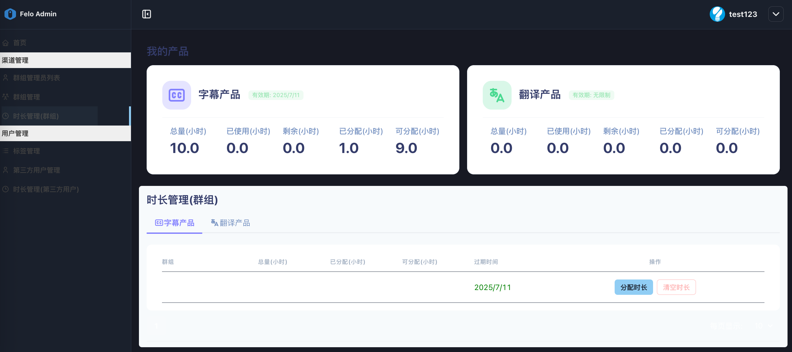
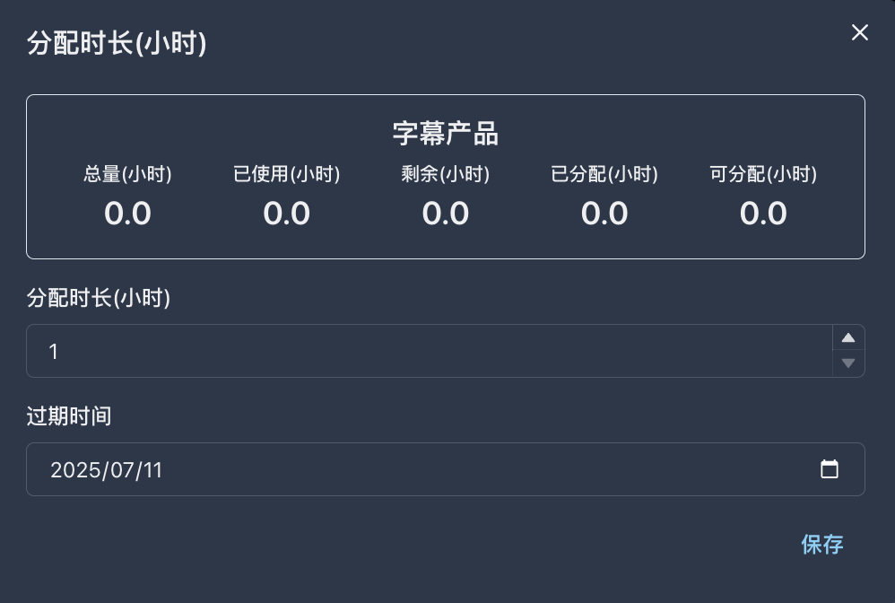

# 2.3 时长管理(群组)

<figure><figcaption></figcaption></figure>

**◼︎功能说明：**\
这里是space管理员的**资源分配仪表盘**。\
此界面上半部分以产品为单位展示当前租户的总资源状态，下半部分则详细列出了每个产品已将这些资源分配给每个**资源组（Group）** 的情况。

**◼︎核心作用：**\
此功能是实现**资源二次分配**和**内部成本控制**的关键。它的核心作用是将从系统提供商那里购买的总资源，精确地划拨给下属的各个资源组。这确保了不同业务单元的资源可被灵活掌控。

**◼︎操作指南：**

1. **监控总资源池：** 页面上方的“我的产品”卡片里显示的是**整个租户账户**的总时长、已向下分配出去的总时长，以及您当前可用于分配的剩余总时长。
2. **选择产品线：** 在下方的“时长管理(群组)”区域，通过点击 **字幕产品** 或 **翻译产品** 标签页，来为不同产品线进行时长分配。
3.  **为资源组分配时长：**

    * 在列表中找到通过[2.2 群组管理](2.2-qun-zu-guan-li.md)进行创建的目标资源组。
    * 点击该行末尾的“分配时长”按钮。
    * 在弹出的窗口中，输入您希望从**租户总资源池**中划拨给**这个特定资源组**的时长数。
    * 确认后，该资源组的“总量”会增加，同时您租户总资源池的“可分配(小时)”会相应减少。

    注意：分配的时长是以小时为单位。过期时间必须指定。

<figure><figcaption></figcaption></figure>

4. **回收已分配的时长：**\
   当需要对已分配到资源组的时长进行回收时，可以点击群组列表行的“清空时长”将其回收。\
   清空后，该资源组的“总量”归零，同时您租户总资源池的“可分配(小时)”会相应增加。

<figure><figcaption></figcaption></figure>

