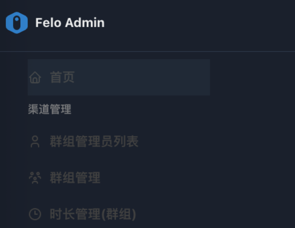

# 2. 渠道管理

<figure><figcaption></figcaption></figure>

**“渠道管理”模块只对具有space管理员权限的角色可见。**

该模块是space管理员进行租户内部业务单元和权限层级管理的核心功能集。旨在实现对租户内部资源和群组管理的精细化控制。该模块包含以下三个菜单组件：

[**2.1 群组管理员列表**](2.1-qun-zu-guan-li-yuan-lie-biao.md): 用于创建和维护群组管理员账户。

[**2.2 群组管理**](2.2-qun-zu-guan-li.md): 用于资源群组的定义与配置。

[**2.3 时长管理(群组)**](2.3-shi-chang-guan-li-qun-zu.md): 用于对群组进行时长资源的分配与额度控制。

通过这三个组件的协同工作，租户管理员能够有效地构建和维护其租户环境内的多层级管理结构和资源分配策略。以下将对各组件进行详细的功能说明。
