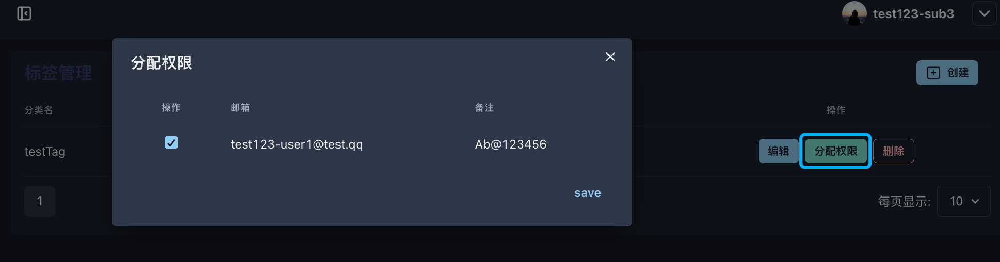

# 3.1 标签管理

<figure><figcaption></figcaption></figure>

**◼︎功能说明：**\
“标签管理”模块用于定义和管理一组**策略规则集 (Policy Rule Sets)**。每个“标签”实质上是一个具名的策略，它通过绑定 **IP地址段** 来构建一条精细化的访问控制与服务路由规则。

**◼︎核心作用：**\
此功能为租户管理员提供了在技术层面对服务进行深度定制的能力，其核心作用在于：

1. **安全访问控制：** 通过配置IP白名单，将特定功能模块的访问权限限制在可信的网络环境中。
2. **差异化服务配置：** 能够为不同的用户群体或应用场景，精准匹配不同的服务，以实现功能、性能或成本的最优组合。
3. **策略化管理：** 将复杂的配置规则抽象为易于理解和复用的“标签”，简化了向大量终端用户应用统一策略的复杂度。
4.

**◼︎操作指南：**

1. **创建标签：** 点击“创建”按钮，填写“分类名”（即标签名称）、“IP”（允许访问的源IP地址或CIDR地址段）。<mark style="color:red;">注意：必须输入有效的IP段(如:192.168.1.0/24)</mark>

<figure><figcaption></figcaption></figure>

2. **分配权限：**&#x521B;建标签后，点击“分配权限”按钮，将该标签（策略）与具体的终端用户进行关联，从而使策略生效。具体的终端用户账号通过3.2 第三方用户管理进行创建。

<figure><figcaption></figcaption></figure>

2. **编辑与删除：** 对已存在的标签策略进行修改或删除。
