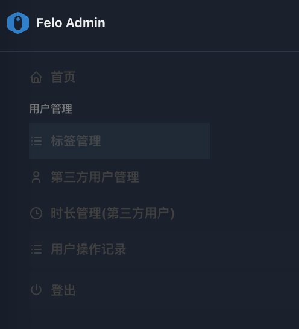

# 3. 用户管理

<figure><figcaption></figcaption></figure>

“**用户管理**”模块是群组管理员（**group管理员或spaceManager）**&#x5BF9;其管辖的群组范围内**终端用户（End-User）** 进行时长分配的核心功能集。\
与“渠道管理”模块不同，此模块专注于对所管辖的群组内的最终使用产品服务的用户实体进行精细化管理。

本模块主要包含以下四个菜单组件：

[**3.1 标签管理**](3.1-biao-qian-guan-li.md): 负责定义和管理高级访问控制与服务策略。\
**注意：标签管理功能对“group管理员”角色不可见。**

[**3.2 第三方用户管理**](3.2-di-san-fang-yong-hu-guan-li.md): 负责终端用户账户的集中式创建和管理。

[**3.3 时长管理(第三方用户)**:](3.3-shi-chang-guan-li-di-san-fang-yong-hu.md) 负责对单个终端用户进行时长资源分配。

[**3.4 用户操作记录**](3.4-yong-hu-cao-zuo-ji-lu.md): 负责对群组内终端用户的操作行为进行记录。

通过这些组件，群组管理员（group管理员或spaceManage&#x72;**）**&#x80FD;够实现对终端用户的资源分配的全方位管理，确保服务的安全、合规与高效运行。
